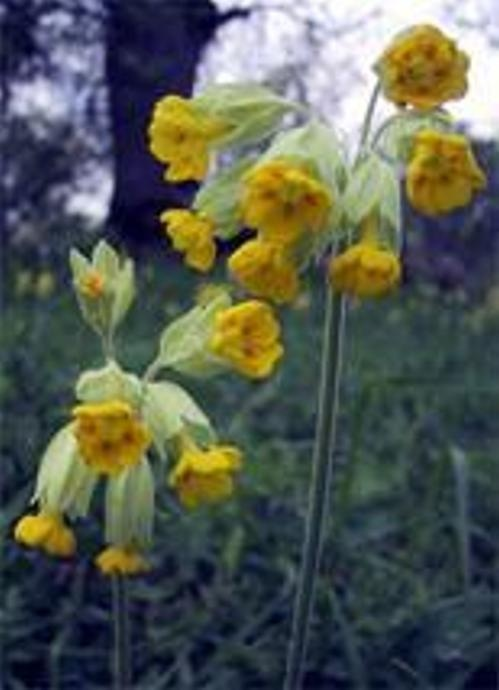
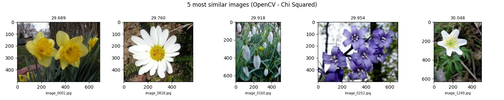
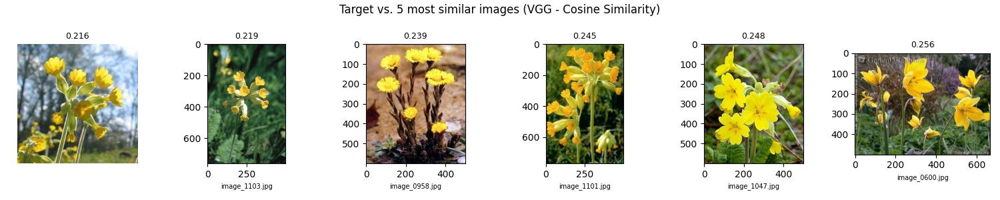

# Image Search With Color Histograms Versus VGG Feature Extraction
This repo contains two different ways of doing image search. The "Base" implementation uses `opencv-python` and computes color histograms of the input images, comparing it to neighbors with Chi Squared scores. The "VGG" implementation uses the `VGG-16` image classification model as a feature extraction tool before computing cosine similarity to neighbors.

# Data
The dataset for this task is the `flowers` dataset, which contains 1308 images (.jpg) of 17 different flowers.

The data should be downloaded from the [Dataset images](https://www.robots.ox.ac.uk/~vgg/data/flowers/17/) link.

Unzip it and extract the `jpg` folder into `flowers` folder in this repo before the script can be run.

# Repository Structure
```
flowers/
  └── image0001.jpg - image1308.jpg # Input images
out/
  └── opencv_distances.csv # CSV file with five closest images for OpenCV
  └── vgg_distances # CSV file with five closest images for VGG
  └── opencv_images.jpg # Plot with five neighbors to target for OpenCV
  └── opencv_target_image.jpg # Target image for OpenCV calculation
  └── vgg_images. jpg # Plot of both target image and five neighbors for VGG
src/
  └── opencv_search.py # The OpenCV implementation
  └── vgg_search.py # VGG Implementation
  └── main.py   # Convenience wrapper for both implementations

setup.sh # Environment setup
requirements.txt
README.md
```

# Reproducing The Analysis
## 1. Setup
I have included a `setup.sh` script which sets up the virtual environment for running analysis.

This does:
```
python -m venv env
source ./env/bin/activate
sudo apt-get update
sudo apt-get install -y python3-opencv
pip install -r requirements.txt
deactivate 
```
## 2. Activate Environment
Run
```
source env/bin/activate
```
## 3. Run Script
Do 
```
python src/main.py
```

This script defaults to a target image index of 42, but argparse is possible to change this: 
```
  --target_index TARGET_INDEX
                        Index of target image to compute neighbors for, defaults to 42
```

## 4. Deactivate
```
deactivate
```

# Summary of Results
Firstly, it is important to take note of the fundamentally different computations which are being done between the two implementations.

The OpenCV implementation is computing color histograms and comparing these on the basis of a Chi Squared measure. This is a measure of dissimilarity, 0 being identical, and the larger the number the more dissimilar.

The VGG implementation is computing Cosine Similarity, which is a measure between 0 and 1, with 0 being identical, 1 being completely opposite.

This means that direct numerical comparisons are nonsensical.

### OpenCV Example Target Image


### OpenCV Examples Neighbors


### VGG Example


From a quantitative standpoint however, extracting features using the pretrained VGG-16 model improves flower classification by a lot. We see that VGG returns the same type of flower even though the background color changes. 

Conversely, the OpenCV color histograms are clearly heavily influenced by background color, with even the five most similar images not even being the same type of flower (to the best of my knowledge.)

# Limitations and Future Directions
Even though using VGG drastically improves image classification, this image model is essentially ancient within the space. This means that upgrading to a newer image model would likely improve performance even further.

For the purposes of image search, it could also make sense to turn toward a CLIP based model, which would afford being able to search for images based on a linguistic embedding of the image rather than only doing reverse image search, which this pipeline is essentially doing.