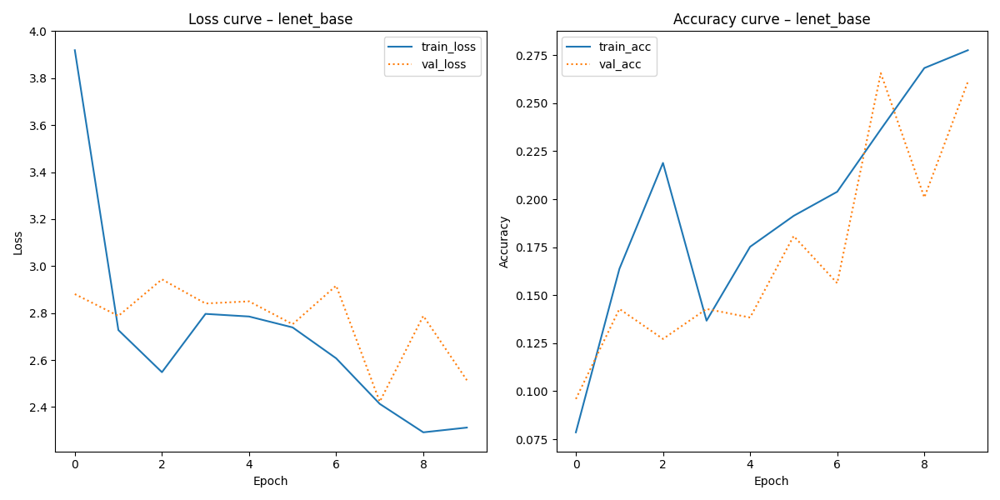
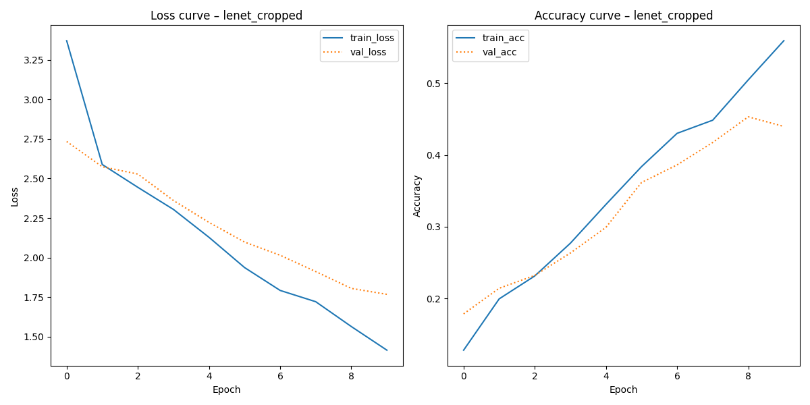
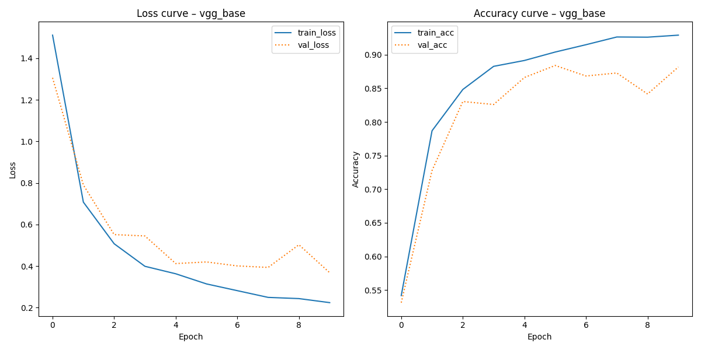
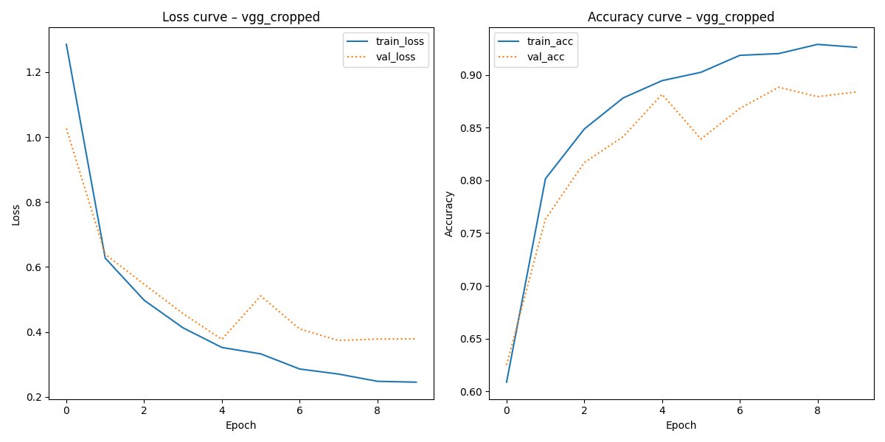

# Classification of LEGO Bricks using Convolutional Neural Networks (CNN)
Two different approaches are used here in order to classify different types of LEGO bricks.

The first approach is a straight CNN based on `LeNET`. The second implementation passes input through `VGG-16` which is used as a feature extraction tool first, before passing these features to a similar CNN.

Both CNN's utilize data augmentation to "increase" the amount of training data available to the model for learning patterns.

The data contains both "base", with the LEGO brick only taking up a small portion of the image, and "cropped" images which are cropped to only contain the brick - both have the brick against a white background with minimal noise.

# Data
The data used here is the `Lego Brick Sorting` dataset (download from Kaggle [here](https://www.kaggle.com/datasets/pacogarciam3/lego-brick-sorting-image-recognition)), which contains 4,580 images split into 20 classes.

This should be unzipped into the `data` folder, structured in the `base` and `cropped` folders.

# Repo Structure
```
data/
  └── base # LEGO Bricks on a white background
  └── cropped # LEGO Bricks on a white background, cropped to only contain the brick
out/
  └── 4*(report_{name}).txt # Classification reports for all combinations of models and datasets
  └── 4*(training_values_{name}.png) # Training plots (loss, acc)
src/
  └── main.py # Convenience wrapper which runs all classification types
  └── lego_classification.py # The classification setup

setup.sh
requirements.txt
README.md
```

# Reproducing the Analysis
## 1. Setup
I have included a `setup.sh` script which sets up the virtual environment for running analysis.

This does:
```
python -m venv env
source ./env/bin/activate
pip install -r requirements.txt
deactivate 
```
## 2. Activate Environment
Run
```
source env/bin/activate
```
## 3. Run Script
Do 
```
python src/main.py
```
The above script defaults to running both classifiers on both data types for 10 epochs, but argparse can be used to change what parts to run.
```
Choosing data type between base and cropped images.
        Also choosing between type of classifier, straight LeNet or using VGG16 for feature extraction first.

options:
  --model MODEL         choice of CNN between 'vgg', 'lenet', or both. Defaults to 'both'
  --data DATA           choice between 'base', 'cropped', or 'both' types of data. Defaults to 'both'
  --epochs EPOCHS       no. of training epochs, defaults to 10
  --batch_size BATCH_SIZE
                        batch size, defaults to 32
```
Output is saved to the `out` folder.

## 4. Deactivate
```
deactivate
```

# Summary of Results
The classification reports indicate that using the pretrained VGG16 network raises classification accuracy on the cropped images a non-neglible amount from ~55% to ~95%.

For the base images it is from ~27% to ~92%. This indicates that using a feature extraction algorithm first significantly improves robustness to input data as the model does not have to learn image recognition from scratch.

### LeNET Base Training Plot


### LeNET Cropped Training Plot


### VGG16 Base Training Plot


### VGG16 Cropped Training Plot


Looking at the training plots, we also see that the VGG16 model seems to train more robustly, and for longer before plateauing and overfitting to the data. It also trains to a significantly higher accuracy (~55% versus ~95%), not taking overfitting into account.

Both share that certain categories are harder to classify than others, seen by lower f1 scores for these categories.

### LeNET Base
```
#### Classification report – lenet_base ####

                 precision    recall  f1-score   support

      Brick_1x1       0.23      0.12      0.16        24
      Brick_1x2       0.10      0.15      0.12        20
      Brick_1x3       0.62      0.26      0.37        19
      Brick_1x4       0.50      0.28      0.36        29
      Brick_2x2       0.12      0.45      0.20        20
    Brick_2x2_L       0.16      0.09      0.11        34
Brick_2x2_Slope       0.29      0.14      0.19        14
      Brick_2x3       0.35      0.41      0.38        17
      Brick_2x4       0.50      0.62      0.56        32
      Plate_1x1       0.26      0.29      0.27        21
Plate_1x1_Round       0.12      0.06      0.08        17
Plate_1x1_Slope       0.18      0.71      0.28        38
      Plate_1x2       0.00      0.00      0.00        30
Plate_1x2_Grill       0.00      0.00      0.00        27
      Plate_1x3       0.70      0.29      0.41        24
      Plate_1x4       0.62      0.26      0.37        19
      Plate_2x2       0.27      0.15      0.19        20
    Plate_2x2_L       0.38      0.10      0.16        29
      Plate_2x3       0.10      0.09      0.10        11
      Plate_2x4       0.75      0.39      0.51        23

       accuracy                           0.26       468
      macro avg       0.31      0.24      0.24       468
   weighted avg       0.31      0.26      0.24       468
```
### LeNET Cropped
```
#### Classification report – lenet_cropped ####

                 precision    recall  f1-score   support

      Brick_1x1       0.31      0.17      0.22        24
      Brick_1x2       0.25      0.30      0.27        20
      Brick_1x3       0.28      0.26      0.27        19
      Brick_1x4       0.71      0.52      0.60        29
      Brick_2x2       0.55      0.60      0.57        20
    Brick_2x2_L       0.41      0.38      0.39        34
Brick_2x2_Slope       0.50      0.21      0.30        14
      Brick_2x3       0.38      0.35      0.36        17
      Brick_2x4       0.37      0.53      0.44        32
      Plate_1x1       0.56      0.24      0.33        21
Plate_1x1_Round       0.83      0.29      0.43        17
Plate_1x1_Slope       0.75      0.24      0.36        38
      Plate_1x2       0.57      0.13      0.22        30
Plate_1x2_Grill       0.80      0.74      0.77        27
      Plate_1x3       0.72      0.54      0.62        24
      Plate_1x4       0.55      0.89      0.68        19
      Plate_2x2       0.28      0.95      0.43        20
    Plate_2x2_L       0.59      0.34      0.43        29
      Plate_2x3       0.24      0.73      0.36        11
      Plate_2x4       0.45      0.83      0.58        23

       accuracy                           0.45       468
      macro avg       0.50      0.46      0.43       468
   weighted avg       0.52      0.45      0.44       468
```
### VGG16 Base
```
#### Classification report – vgg_base ####

                 precision    recall  f1-score   support

      Brick_1x1       0.84      0.70      0.76        23
      Brick_1x2       0.65      1.00      0.79        17
      Brick_1x3       0.92      0.86      0.89        28
      Brick_1x4       0.83      0.97      0.90        31
      Brick_2x2       0.77      1.00      0.87        23
    Brick_2x2_L       0.93      0.89      0.91        28
Brick_2x2_Slope       1.00      0.71      0.83        17
      Brick_2x3       0.95      0.88      0.91        24
      Brick_2x4       0.84      0.91      0.88        23
      Plate_1x1       0.73      0.95      0.83        20
Plate_1x1_Round       1.00      1.00      1.00        15
Plate_1x1_Slope       1.00      0.78      0.88        45
      Plate_1x2       0.95      0.88      0.91        24
Plate_1x2_Grill       1.00      1.00      1.00        26
      Plate_1x3       1.00      0.83      0.91        29
      Plate_1x4       0.90      1.00      0.95        18
      Plate_2x2       0.96      1.00      0.98        22
    Plate_2x2_L       0.96      1.00      0.98        22
      Plate_2x3       1.00      0.88      0.93        16
      Plate_2x4       1.00      1.00      1.00        17

       accuracy                           0.90       468
      macro avg       0.91      0.91      0.90       468
   weighted avg       0.92      0.90      0.90       468
```
### VGG16 Cropped
```
#### Classification report – vgg_cropped ####

                 precision    recall  f1-score   support

      Brick_1x1       0.95      0.87      0.91        23
      Brick_1x2       0.76      0.94      0.84        17
      Brick_1x3       0.92      0.86      0.89        28
      Brick_1x4       0.80      0.90      0.85        31
      Brick_2x2       1.00      0.70      0.82        23
    Brick_2x2_L       0.83      0.89      0.86        28
Brick_2x2_Slope       1.00      0.94      0.97        17
      Brick_2x3       0.71      0.92      0.80        24
      Brick_2x4       0.83      0.83      0.83        23
      Plate_1x1       0.95      0.95      0.95        20
Plate_1x1_Round       1.00      1.00      1.00        15
Plate_1x1_Slope       1.00      0.98      0.99        45
      Plate_1x2       0.86      1.00      0.92        24
Plate_1x2_Grill       1.00      1.00      1.00        26
      Plate_1x3       1.00      0.76      0.86        29
      Plate_1x4       0.76      0.89      0.82        18
      Plate_2x2       1.00      1.00      1.00        22
    Plate_2x2_L       1.00      0.95      0.98        22
      Plate_2x3       1.00      0.88      0.93        16
      Plate_2x4       0.88      0.82      0.85        17

       accuracy                           0.90       468
      macro avg       0.91      0.90      0.90       468
   weighted avg       0.91      0.90      0.90       468
```

From these classification plots, it should be clear that especially the `LeNET` model seems to be "giving up" classifying some of the harder categories, and is instead focusing its learning on the easier categories. This is seen by f1 scores of 0 in classes such as `Plate_1x2`.

Another interesting finding is the fact that the Cropped data seems to be performing better. Intuitively this makes sense, as the object of interest takes up most of the image in the cropped version of the data, where it is only a small part of it in the base version.

# Limitations and Future Directions
The approach in this repo is far from perfect, even if it does constitute a viable approach to classifying the given images. 

Firstly, the base LeNet CNN has been created with "default" layers and is not as such tuned for optimal accuracy for the task at hand. The same goes for the classification layers following VGG16 in the VGG model. 

Secondly, no hyperparameter tuning was done. This means that the default values have not been selected from a place of maximizing accuracy to the task - this could potentially garner significant improvements to the classifiers. 

Thirdly, the data is split into train / val / test segments with a fixed seed. This seed does not return perfectly balanced datasets (seen from support in classification report) so a different seed could potentially return more balanced datasets which should theoretically improve model accuracy. Building on this point, it should also be possible to do a stratified split which ensures class balance without relying on a seed.

Finally, both types of models seem to overfit quite quickly to the data. It could make sense to do even more data augmentation to the input in order to let the models train slower, which should theoretically increase robustness.

These limitations should have you thinking back to some of the harder classes which LeNET simply gave up on - the dataset is certainly not large enough to train an image recognition algorithm from scratch.