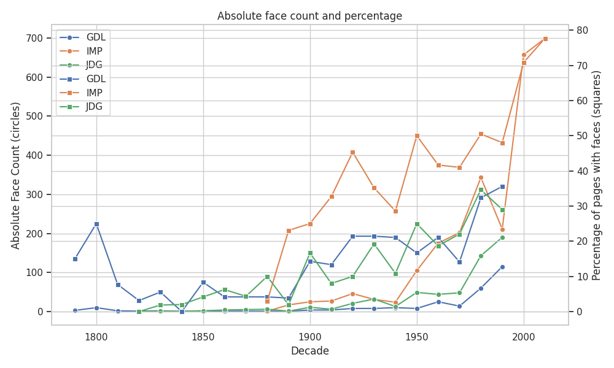
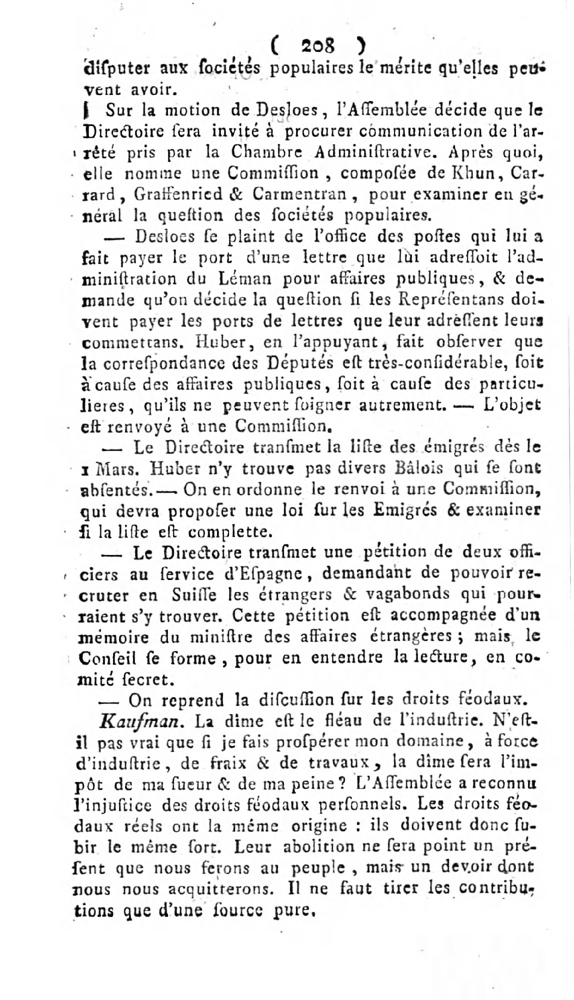

# Detecting faces in historical newspapers
This repo contains code for detecting faces in historical newspapers using a pretrained facial detection model.

This is used to determine whether faces have begun appearing more throughout history, as it gradually become more commonplace with access to cameras and printing technology improved.

# Data
The data contains scanned pages of three different Swiss newspapers, they are structured with date and newspaper name.

The data should be downloaded from [Zenodo](https://zenodo.org/records/3706863), and then unzipped into the `data` folder before the script can be run. 

The structure should be kept so the data folder contains `GDL`, `IMP`, and `JDG` 

# Repo Structure
```
data/
  └── GDL
  └── IMP
  └── JDG
out/
  └── faces.csv # A CSV containing newspaper, date, decade, page, and face count
  └── sns_figure.jpg # plot containing absolute and relative face count throughout the decades
src/
  └── main.py # Convenience wrapper which runs classification and saves output
  └── face_detection.py # The classification and analysis setup

example.jpg # an example image of the newspapers
setup.sh
requirements.txt
README.md
```

# Reproducing the Analysis
## 1. Setup
I have included a `setup.sh` script which sets up the virtual environment for running analysis.

This does:
```
python -m venv env
source ./env/bin/activate
pip install -r requirements.txt
deactivate 
```
## 2. Activate Environment
Run
```
source env/bin/activate
```
## 3. Run Script
Do 
```
python src/main.py
```
The script takes no command line arguments. 

Output is saved to the `out` folder.

## 4. Deactivate
```
deactivate
```

# Summary of Results

From a quantitative look at the figure, it seems that around the 1900's is the common time where all three newspapers truly begin including faces (likely images in general) in their publications. 

The trend seems to be relatively similar between the three newspapers, even though "IMP" seems to contain most faces - most likely this is a more picture based media than the other two.

We also have the most recent data for IMP, so actual comparison across is slightly difficult, as newer years seem to contain more faces in general. 

# Limitations and Future Directions
The facial detection algorithm is arguably not conservative enough, as it classifies faces where there quite clearly are none, see an example of a page which allegedly contains a face below:



The reasons for the classifier detecting faces where there are none are outside the scope of this repository, but it does warrant caution when interpreting the rest of the results.

In the future it could be interesting to rerun this analysis using a more precise face detection algorithm and with more up to date data in order to see if the trend of increasing count continues. 